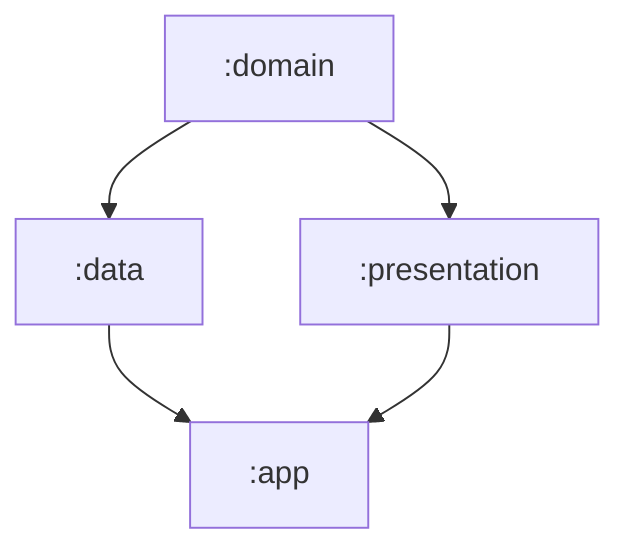

# Compose clean arch multimodule example 

## Modules schema:


## Modules implementation:
```kotlin
[versions]
agp = "8.12.0-alpha08"
hiltNavigationCompose = "1.2.0"
kotlin = "2.2.0"
coreKtx = "1.16.0"
junit = "4.13.2"
junitVersion = "1.2.1"
espressoCore = "3.6.1"
lifecycleRuntimeKtx = "2.9.2"
activityCompose = "1.10.1"
composeBom = "2025.07.00"
appcompat = "1.7.1"
material = "1.12.0"
hiltAndroid = "2.57"

[libraries]
androidx-core-ktx = { group = "androidx.core", name = "core-ktx", version.ref = "coreKtx" }
androidx-hilt-navigation-compose = { module = "androidx.hilt:hilt-navigation-compose", version.ref = "hiltNavigationCompose" }
junit = { group = "junit", name = "junit", version.ref = "junit" }
androidx-junit = { group = "androidx.test.ext", name = "junit", version.ref = "junitVersion" }
androidx-espresso-core = { group = "androidx.test.espresso", name = "espresso-core", version.ref = "espressoCore" }
androidx-lifecycle-runtime-ktx = { group = "androidx.lifecycle", name = "lifecycle-runtime-ktx", version.ref = "lifecycleRuntimeKtx" }
androidx-activity-compose = { group = "androidx.activity", name = "activity-compose", version.ref = "activityCompose" }
androidx-compose-bom = { group = "androidx.compose", name = "compose-bom", version.ref = "composeBom" }
androidx-ui = { group = "androidx.compose.ui", name = "ui" }
androidx-ui-graphics = { group = "androidx.compose.ui", name = "ui-graphics" }
androidx-ui-tooling = { group = "androidx.compose.ui", name = "ui-tooling" }
androidx-ui-tooling-preview = { group = "androidx.compose.ui", name = "ui-tooling-preview" }
androidx-ui-test-manifest = { group = "androidx.compose.ui", name = "ui-test-manifest" }
androidx-ui-test-junit4 = { group = "androidx.compose.ui", name = "ui-test-junit4" }
androidx-material3 = { group = "androidx.compose.material3", name = "material3" }
androidx-appcompat = { group = "androidx.appcompat", name = "appcompat", version.ref = "appcompat" }
material = { group = "com.google.android.material", name = "material", version.ref = "material" }
hilt-android = { module = "com.google.dagger:hilt-android", version.ref = "hiltAndroid" } # Hilt Android
hilt-android-compiler = { module = "com.google.dagger:hilt-android-compiler", version.ref = "hiltAndroid" } # Hilt Android Compiler

[plugins]
android-application = { id = "com.android.application", version.ref = "agp" }
kotlin-android = { id = "org.jetbrains.kotlin.android", version.ref = "kotlin" }
kotlin-compose = { id = "org.jetbrains.kotlin.plugin.compose", version.ref = "kotlin" }
android-library = { id = "com.android.library", version.ref = "agp" }
kotlin-kapt = { id = "org.jetbrains.kotlin.kapt", version.ref = "kotlin" }
hilt-android = { id = "com.google.dagger.hilt.android", version.ref = "hiltAndroid" }

[bundles]
core = ["androidx-core-ktx", "androidx-appcompat", "material", "androidx-lifecycle-runtime-ktx"]
compose = ["androidx-ui",
    "androidx-ui-graphics",
    "androidx-ui-tooling-preview",
    "androidx-material3",
    "androidx-activity-compose"]
compose-debug = ["androidx-ui-tooling", "androidx-ui-test-manifest"]
```